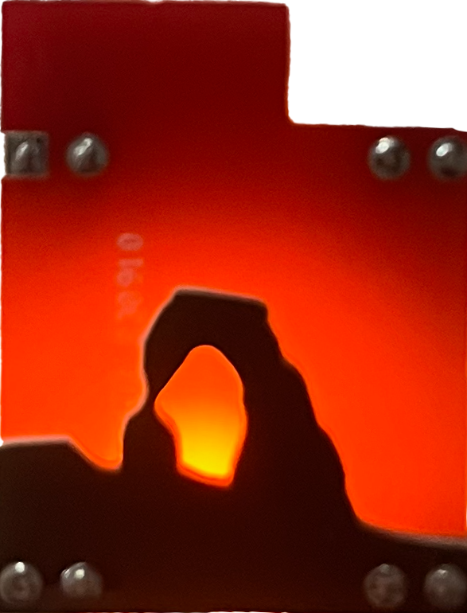

# Delicate Arch Silhouette

This was an experiment with using multple PCBs to create layers. I also played around with dithering the solder mask on the back to simulate a gradient between the yellow LED and the red board when viewed from the front.

30 produced

## Build guide
Click the picture to watch the video.

1. Solder SMD components on back of Utah-shaped badge
    - LED goes in the spot labelled D1 with the cathode (green) end to the left.
    - Resistor goes vertically in the R1 spot
1. Solder headers to the Utah badge
    - On the bottom headers use VERY LITTLE solder. The silhouette board will need to lie directly on top of this board and too much solder will prevent it from lying flat.
1. Solder the silhouette board on top of the Utah one using the bottom headers. The side labelled "backside" should be facing the other board

## Parts
1x 1206 yellow LED

1x 1206 47Ω resistor

4x 2-pin header
